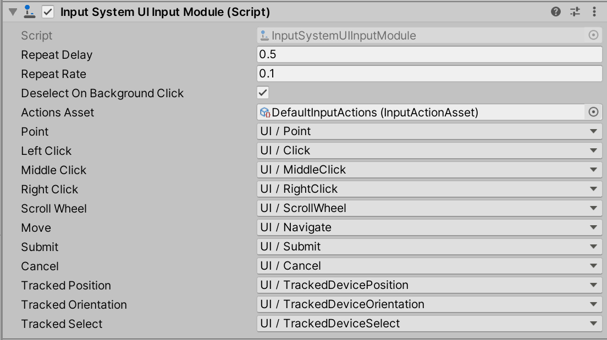

# UI support

You can use the Input System package to control any in-game UI created with the [Unity UI package](https://docs.unity3d.com/Manual/UISystem.html). The integration between the Input System and the UI system is handled by the [`InputSystemUIInputModule`](../api/UnityEngine.InputSystem.UI.InputSystemUIInputModule.html) component.

>NOTE: The Input System package does not currently support IMGUI or UIElements. This is in development.

## `InputSystemUIInputModule` Component

The [`InputSystemUIInputModule`](../api/UnityEngine.InputSystem.UI.InputSystemUIInputModule.html) component acts as a drop-in replacement for the [`StandaloneInputModule`](https://docs.unity3d.com/Manual/script-StandaloneInputModule.html) component that the Unity UI package. [`InputSystemUIInputModule`](../api/UnityEngine.InputSystem.UI.InputSystemUIInputModule.html) provides the same functionality as  [`StandaloneInputModule`](https://docs.unity3d.com/Manual/script-StandaloneInputModule.html), but it uses the Input System instead of the legacy Input Manager to drive UI input.

If you have a [`StandaloneInputModule`](https://docs.unity3d.com/Manual/script-StandaloneInputModule.html) component on a GameObject, and the Input System is installed, Unity shows a button in the Inspector offering to automatically replace it with a [`InputSystemUIInputModule`](../api/UnityEngine.InputSystem.UI.InputSystemUIInputModule.html) for you. The [`InputSystemUIInputModule`](../api/UnityEngine.InputSystem.UI.InputSystemUIInputModule.html) is pre-configured to use default Input Actions to drive the UI, but you can override that configuration to suit your needs.

You can use the following properties to configure [`InputSystemUIInputModule`](../api/UnityEngine.InputSystem.UI.InputSystemUIInputModule.html):

|Property|Description|
|--------|-----------|
|[`Repeat Delay`](../api/UnityEngine.InputSystem.UI.InputSystemUIInputModule.html#UnityEngine_InputSystem_UI_InputSystemUIInputModule_repeatDelay)|The initial delay (in seconds) between generating an initial navigation event and generating repeated navigation events when the __Move__ Action stays actuated.|
|[`Repeat Rate`](../api/UnityEngine.InputSystem.UI.InputSystemUIInputModule.html#UnityEngine_InputSystem_UI_InputSystemUIInputModule_repeatDelay)|The interval (in seconds) between generating repeat navigation events when the __Move__ Action stays actuated.|
|[`Actions Asset`](../api/UnityEngine.InputSystem.UI.InputSystemUIInputModule.html#UnityEngine_InputSystem_UI_InputSystemUIInputModule_actionsAsset)|An [`Input Action Asset`](ActionAssets.md) containing all the Actions to control the UI. You can choose which Actions in the Asset correspond to which UI inputs using the following properties.  By default, this references a built-in Asset named *DefaultInputActions*, which contains common default Actions for driving UI. If you want to set up your own Actions, [create a custom Input Action Asset](ActionAssets.md#creating-input-action-assets) and assign it here. When you assign a new Asset reference to this field in the Inspector, the Editor attempts to automatically map Actions to UI inputs based on common naming conventions.|
|[`Deselect on Background Click`](../api/UnityEngine.InputSystem.UI.InputSystemUIInputModule.html#UnityEngine_InputSystem_UI_InputSystemUIInputModule_deselectOnBackgroundClick)|By default, when the pointer is clicked and does not hit any `GameObject`, the current selection is cleared. This, however, can get in the way of keyboard and gamepad navigation which will want to work off the currently selected object. To prevent automatic deselection, set this property to false.|

You can use the following properties to map Actions from the chosen [__Actions Asset__](../api/UnityEngine.InputSystem.UI.InputSystemUIInputModule.html#UnityEngine_InputSystem_UI_InputSystemUIInputModule_actionsAsset) to UI input Actions. In the Inspector, these appear as foldout lists that contain all the Actions in the Asset:

|Property|Description|
|--------|-----------|
|[`Point`](../api/UnityEngine.InputSystem.UI.InputSystemUIInputModule.html#UnityEngine_InputSystem_UI_InputSystemUIInputModule_point)|An Action that delivers a 2D screen position. Use as a cursor for pointing at UI elements to implement mouse-style UI interactions.|
|[`Left Click`](../api/UnityEngine.InputSystem.UI.InputSystemUIInputModule.html#UnityEngine_InputSystem_UI_InputSystemUIInputModule_leftClick)|An Action that maps to the primary cursor button used to interact with UI.|
|[`Middle Click`](../api/UnityEngine.InputSystem.UI.InputSystemUIInputModule.html#UnityEngine_InputSystem_UI_InputSystemUIInputModule_middleClick)|An Action that maps to the middle cursor button used to interact with UI.|
|[`Right Click`](../api/UnityEngine.InputSystem.UI.InputSystemUIInputModule.html#UnityEngine_InputSystem_UI_InputSystemUIInputModule_rightClick)|An Action that maps to the secondary cursor button used to interact with UI.|
|[`Scroll Wheel`](../api/UnityEngine.InputSystem.UI.InputSystemUIInputModule.html#UnityEngine_InputSystem_UI_InputSystemUIInputModule_scrollWheel)|An Action that delivers gesture input to allow scrolling in the UI.|
|[`Move`](../api/UnityEngine.InputSystem.UI.InputSystemUIInputModule.html#UnityEngine_InputSystem_UI_InputSystemUIInputModule_move)|An Action that delivers a 2D vector used to select the currently active UI [selectable](https://docs.unity3d.com/Manual/script-Selectable.html). This allows a gamepad or arrow-key style navigation of the UI.|
|[`Submit`](../api/UnityEngine.InputSystem.UI.InputSystemUIInputModule.html#UnityEngine_InputSystem_UI_InputSystemUIInputModule_submit)|An Action to engage with or "click" the currently selected UI [selectable](https://docs.unity3d.com/Manual/script-Selectable.html).|
|[`Cancel`](../api/UnityEngine.InputSystem.UI.InputSystemUIInputModule.html#UnityEngine_InputSystem_UI_InputSystemUIInputModule_cancel)|An Action to exit any interaction with the currently selected UI [selectable](https://docs.unity3d.com/Manual/script-Selectable.html).|
|[`Tracked Device Position`](../api/UnityEngine.InputSystem.UI.InputSystemUIInputModule.html#UnityEngine_InputSystem_UI_InputSystemUIInputModule_trackedDevicePosition)|An Action that delivers a 3D position of one or multiple spatial tracking devices, such as XR hand controllers. In combination with [`Tracked Device Orientation`](../api/UnityEngine.InputSystem.UI.InputSystemUIInputModule.html#UnityEngine_InputSystem_UI_InputSystemUIInputModule_trackedDeviceOrientation), this allows XR-style UI interactions by pointing at UI [selectables](https://docs.unity3d.com/Manual/script-Selectable.html) in space.|
|[`Tracked Device Orientation`](../api/UnityEngine.InputSystem.UI.InputSystemUIInputModule.html#UnityEngine_InputSystem_UI_InputSystemUIInputModule_trackedDeviceOrientation)|An Action that delivers a quaternion representing the rotation of one or multiple spatial tracking devices, such as XR hand controllers. In combination with [`Tracked Device Position`](../api/UnityEngine.InputSystem.UI.InputSystemUIInputModule.html#UnityEngine_InputSystem_UI_InputSystemUIInputModule_trackedDevicePosition), this allows XR-style UI interactions by pointing at UI [selectables](https://docs.unity3d.com/Manual/script-Selectable.html) in space.|
|[`Tracked Device Select`](../api/UnityEngine.InputSystem.UI.InputSystemUIInputModule.html#UnityEngine_InputSystem_UI_InputSystemUIInputModule_trackedDeviceSelect)|An Action to submit "clicks" on UI [selectables](https://docs.unity3d.com/Manual/script-Selectable.html) coming from a spatial tracking device. For example, you can map this to the trigger button on an XR controller to  allows XR-style UI interactions in combination with [`Tracked Device Position`](../api/UnityEngine.InputSystem.UI.InputSystemUIInputModule.html#UnityEngine_InputSystem_UI_InputSystemUIInputModule_trackedDevicePosition) and [`Tracked Device Orientation`](../api/UnityEngine.InputSystem.UI.InputSystemUIInputModule.html#UnityEngine_InputSystem_UI_InputSystemUIInputModule_trackedDeviceOrientation).|

## `MultiplayerEventSystem` Component

The Input System can also handle multiple separate UI instances on the screen controlled separately from different input Bindings. This is useful if you want to have multiple local players share a single screen with different controllers, so that every player can control their own UI instance. To allow this, you need to replace the [`EventSystem`](https://docs.unity3d.com/Manual/script-EventSystem.html) component from Unity with the Input System's [`MultiplayerEventSystem`](../api/UnityEngine.InputSystem.UI.MultiplayerEventSystem.html) component.

Unlike the [`EventSystem`](https://docs.unity3d.com/Manual/script-EventSystem.html) component, you can have multiple [`MultiplayerEventSystems`](../api/UnityEngine.InputSystem.UI.MultiplayerEventSystem.html) active in the Scene at the same time. That way, you can have multiple players, each with their own [`InputSystemUIInputModule`](../api/UnityEngine.InputSystem.UI.InputSystemUIInputModule.html) and [`MultiplayerEventSystem`](../api/UnityEngine.InputSystem.UI.MultiplayerEventSystem.html) components, and each player can have their own set of Actions driving their own UI instance. If you are using the [`PlayerInput`](Components.md#playerinput-component) component, you can also set up [`PlayerInput`](Components.md#playerinput-component) to automatically configure the player's [`InputSystemUIInputModule`](../api/UnityEngine.InputSystem.UI.InputSystemUIInputModule.html) to use the player's Actions. See the documentation on [`PlayerInput`](Components.md#ui-input) to learn how.

The properties of the [`MultiplayerEventSystem`](../api/UnityEngine.InputSystem.UI.MultiplayerEventSystem.html) component are identical with those from the [Event System](https://docs.unity3d.com/Manual/script-EventSystem.html). Additionally, the [`MultiplayerEventSystem`](../api/UnityEngine.InputSystem.UI.MultiplayerEventSystem.html) component adds a [`playerRoot`](../api/UnityEngine.InputSystem.UI.MultiplayerEventSystem.html#UnityEngine_InputSystem_UI_MultiplayerEventSystem_playerRoot) property, which you can set to a GameObject that contains all the UI [selectables](https://docs.unity3d.com/Manual/script-Selectable.html) this event system should handle in its hierarchy. Mouse input that this event system processes then ignores any UI selectables which are not on any GameObject in the Hierarchy under  [`Player Root`](../api/UnityEngine.InputSystem.UI.MultiplayerEventSystem.html#UnityEngine_InputSystem_UI_MultiplayerEventSystem_playerRoot).
