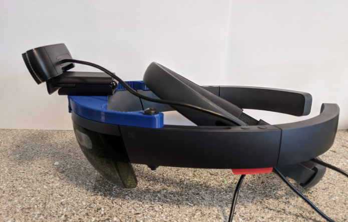
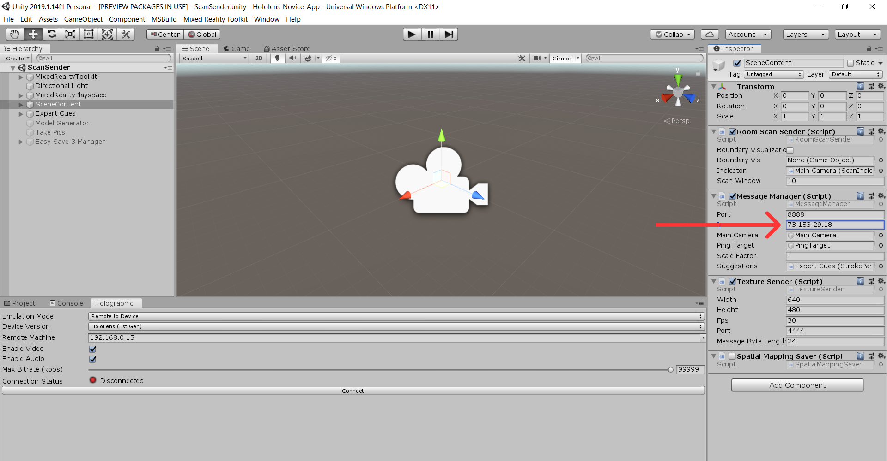
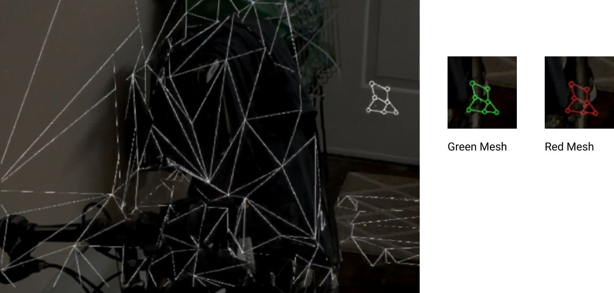

# AR Technician Application

## Setup
This application uses the Microsoft Hololens with Unity through the MRTK's Holographic Remoting Tool. Make sure you have Unity Hub installed already before you begin. An external webcam mounted to the Hololens is required to enable the video stream.

### Hardware
- Acquire a USB Webcam (we used [this](https://www.logitech.com/en-us/product/hd-pro-webcam-c920) camera, but any usb webcam will work with our system) and plug it into your computer.
- Print out [this](./Assets/Resources/hololensMount_V3.STL) camera mount for the Hololens (PLA is what we used).
- To attach the mount properly, you will need a 1/4 inch x 1/2 inch flat head screw for the camera to screw on to, and two 10-32 x 2 inch Round Head screw with a nut for the sides.
  
*Hololens with Camera Mounted*

### Software
- Perform system setup for the MRTK specifically install Visual Studio 2019 and Windows SDK from [here](https://microsoft.github.io/MixedRealityToolkit-Unity/version/releases/2.1.0/Documentation/GettingStartedWithTheMRTK.html) (the MRTK is already installed in the project)
- Open Unity Hub and add the application by selecting the project folder named “Hololense-Novice-App”.
- Install Unity Version 2019.1.14f1 (Unity Hub should prompt you to install this). *Make sure you include Universal Windows Platform build support*
- Open the project from Unity Hub
- Open up the build settings and confirm that the platform is set to *Universal Windows Platform*
- Make sure your Hololens is on and follow this [tutorial on setting up Holographic Remoting](https://docs.microsoft.com/en-us/windows/mixed-reality/unity-play-mode)

### Connecting to the Expert
To connect to expert, all you need to do is enter the IP address of the Expert's computer and run the application. You can find the field for this on the `Message Manager` Component of the *SceneContent* game object.

## Features/Controls
Once you connect to the Expert you will have access to the following features.
- **Environment Scan**: By performing a 'pinch' gesture in front of the Hololens, you will begin a scan of the environment. On a successful gesture you will see white lines outlining the current scan. The scan is generated as you look around, so to create a full scan of the room, make sure to look at all parts of the room. To send the scan over to the expert app, perform a 'pinch' again. You will see the mesh preview disappear when the gesture is registered. Note, you can only begin a scan when the Mesh icon is green in the right corner of the view. While scanning it will appear white, and when the icon is red that indicates the Hololens is still mapping the environment. Below you can see what the scanning looks like.

*Mesh preview during scan and icons*

- **Expert Highlight**: When the expert sends a highlight you will see it as a virtual element overlaid in your view of the real world environment. If you are not looking directly at it, a small white dot will appear at the edge of your view, indicating the direction you should look to find the highlight.
- **Expert Annotation**: As the expert creates annotations, they will appear overlaid in the view of the real environment as virtual red drawings.
